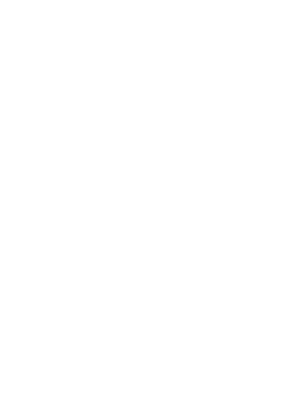

<!-- Improved compatibility of back to top link: See: https://github.com/othneildrew/Best-README-Template/pull/73 -->

<a id="readme-top"></a>

<!--
*** Thanks for checking out the Best-README-Template. If you have a suggestion
*** that would make this better, please fork the repo and create a pull request
*** or simply open an issue with the tag "enhancement".
*** Don't forget to give the project a star!
*** Thanks again! Now go create something AMAZING! :D
-->

<!-- PROJECT SHIELDS -->
<!--
*** I'm using markdown "reference style" links for readability.
*** Reference links are enclosed in brackets [ ] instead of parentheses ( ).
*** See the bottom of this document for the declaration of the reference variables
*** for contributors-url, forks-url, etc. This is an optional, concise syntax you may use.
*** https://www.markdownguide.org/basic-syntax/#reference-style-links
-->

[![Contributors][contributors-shield]][contributors-url]
[![Forks][forks-shield]][forks-url]
[![Stargazers][stars-shield]][stars-url]
[![Issues][issues-shield]][issues-url]
[![project_license][license-shield]][license-url]
[![LinkedIn][linkedin-shield]][linkedin-url]

<!-- PROJECT LOGO -->
<br />
<div align="center">
  <a href="https://github.com/ayemteezy/sign-up-form">
    
  </a>

<h3 align="center">Odin Sign-Up Form</h3>

  <p align="center">
     A responsive sign-up form for an imaginary service, built as part of The Odin Project's Intermediate HTML and CSS curriculum. Focuses on form structure, client-side validation, and CSS styling techniques.
    <br />
    <a href="https://github.com/ayemteezy/sign-up-form"><strong>Explore the docs »</strong></a>
    <br />
    <br />
    <a href="https://ayemteezy.github.io/sign-up-form/">View Demo</a>
    &middot;
    <a href="https://github.com/ayemteezy/sign-up-form/issues/new?labels=bug&template=bug-report.md">Report Bug</a>
    &middot;
    <a href="https://github.com/ayemteezy/sign-up-form/issues/new?labels=enhancement&template=feature-request.md">Request Feature</a>
  </p>
</div>

<!-- TABLE OF CONTENTS -->
<details>
  <summary>Table of Contents</summary>
  <ol>
    <li>
      <a href="#about-the-project">About The Project</a>
      <ul>
        <li><a href="#built-with">Built With</a></li>
      </ul>
    </li>
    <li>
      <a href="#getting-started">Getting Started</a>
      <ul>
        <li><a href="#prerequisites">Prerequisites</a></li>
        <li><a href="#installation">Installation</a></li>
      </ul>
    </li>
    <li><a href="#features">Features</a></li>
    <li><a href="#roadmap">Roadmap</a></li>
    <li><a href="#contributing">Contributing</a></li>
    <li><a href="#license">License</a></li>
    <li><a href="#contact">Contact</a></li>
    <li><a href="#acknowledgments">Acknowledgments</a></li>
  </ol>
</details>

<!-- ABOUT THE PROJECT -->

## About The Project

[![Sign Up Form Screen Shot][product-screenshot]](https://ayemteezy.github.io/sign-up-form/)

This project is part of [The Odin Project](https://www.theodinproject.com/lessons/node-path-intermediate-html-and-css-sign-up-form)'s Intermediate HTML and CSS course. The goal was to build a sign-up form for an imaginary service, putting into practice skills in intermediate HTML concepts, CSS styling, and client-side form validation.

The layout features a full-height image sidebar with a semi-transparent logo overlay, and a form panel with styled, validated input fields. No data is stored or submitted — the focus is entirely on front-end structure and validation behavior.

<p align="right">(<a href="#readme-top">back to top</a>)</p>

### Built With

- [![HTML5][HTML5]][HTML5-url]
- [![CSS3][CSS3]][CSS3-url]

<p align="right">(<a href="#readme-top">back to top</a>)</p>

<!-- GETTING STARTED -->

## Getting Started

o get a local copy up and running, follow these steps.

### Prerequisites

No build tools or package managers are required. Just a modern web browser.

### Installation

1. Clone the repo

```sh
   git clone https://github.com/ayemteezy/sign-up-form.git
```

2. Open `index.html` in your browser

```sh
   open index.html
```

Or simply drag and drop the file into your browser window.

<p align="right">(<a href="#readme-top">back to top</a>)</p>

<!-- USAGE EXAMPLES -->

## Features

- Two-panel layout: full-height image sidebar + form panel
- Custom external font (Norse Bold) for the logo section
- Input field validation using the `:user-invalid` and `:focus` CSS pseudo-classes
  - Password fields display a **red border** when the input is invalid
  - Active/focused fields display a **blue border** with a subtle box-shadow
- "Create Account" button styled with a color sampled from the background image (`#596D48`)
- Semi-transparent dark overlay on the sidebar logo for readability against a busy background image

<p align="right">(<a href="#readme-top">back to top</a>)</p>

<!-- ROADMAP -->

## Roadmap

- [x] Page layout with image sidebar
- [x] Form fields with labels
- [x] CSS-based input validation styling

See the [open issues](https://github.com/ayemteezy/sign-up-form/issues) for a full list of proposed features (and known issues).

<p align="right">(<a href="#readme-top">back to top</a>)</p>

<!-- CONTRIBUTING -->

## Contributing

Contributions are what make the open source community such an amazing place to learn, inspire, and create. Any contributions you make are **greatly appreciated**.

If you have a suggestion that would make this better, please fork the repo and create a pull request. You can also simply open an issue with the tag "enhancement".
Don't forget to give the project a star! Thanks again!

1. Fork the Project
2. Create your Feature Branch (`git checkout -b feature/AmazingFeature`)
3. Commit your Changes (`git commit -m 'Add some AmazingFeature'`)
4. Push to the Branch (`git push origin feature/AmazingFeature`)
5. Open a Pull Request

<p align="right">(<a href="#readme-top">back to top</a>)</p>

### Top contributors:

<a href="https://github.com/ayemteezy/sign-up-form/graphs/contributors">
  
</a>

<!-- LICENSE -->

## License

Distributed under the MIT License. See `LICENSE.txt` for more information.

<p align="right">(<a href="#readme-top">back to top</a>)</p>

<!-- CONTACT -->

## Contact

- Twitter/X: [@ayemteezy\_](https://x.com/ayemteezy_)
- Email: [laurencelestercarino@gmail.com](mailto:laurencelestercarino@gmail.com)
- GitHub: [ayemteezy](https://github.com/ayemteezy)

Project Link: [https://github.com/ayemteezy/calculator-app](https://github.com/ayemteezy/calculator-app)

<p align="right">(<a href="#readme-top">back to top</a>)</p>

<!-- ACKNOWLEDGMENTS -->

## Acknowledgments

- [The Odin Project](https://www.theodinproject.com/) — for the project brief and curriculum
- [Norse Bold Font](https://www.dafont.com/norse.font) by Joël Carrouché — used for the logo section
- [Unsplash](https://unsplash.com/) — for the background image
- [Odin Logo](https://www.theodinproject.com/) — used in the image sidebar
- [contrib.rocks](https://contrib.rocks) — contributor image generator

<p align="right">(<a href="#readme-top">back to top</a>)</p>

<!-- MARKDOWN LINKS & IMAGES -->
<!-- https://www.markdownguide.org/basic-syntax/#reference-style-links -->

[contributors-shield]: https://img.shields.io/github/contributors/ayemteezy/sign-up-form.svg?style=for-the-badge
[contributors-url]: https://github.com/ayemteezy/sign-up-form/graphs/contributors
[forks-shield]: https://img.shields.io/github/forks/ayemteezy/sign-up-form.svg?style=for-the-badge
[forks-url]: https://github.com/ayemteezy/sign-up-form/network/members
[stars-shield]: https://img.shields.io/github/stars/ayemteezy/sign-up-form.svg?style=for-the-badge
[stars-url]: https://github.com/ayemteezy/sign-up-form/stargazers
[issues-shield]: https://img.shields.io/github/issues/ayemteezy/sign-up-form.svg?style=for-the-badge
[issues-url]: https://github.com/ayemteezy/sign-up-form/issues
[license-shield]: https://img.shields.io/github/license/ayemteezy/sign-up-form.svg?style=for-the-badge
[license-url]: https://github.com/ayemteezy/sign-up-form/blob/master/LICENSE.txt
[linkedin-shield]: https://img.shields.io/badge/-LinkedIn-black.svg?style=for-the-badge&logo=linkedin&colorB=555
[linkedin-url]: https://www.linkedin.com/in/laurence-lester-cari%C3%B1o/
[product-screenshot]: images/screenshot.jpg

<!-- Shields.io badges. You can a comprehensive list with many more badges at: https://github.com/inttter/md-badges -->

[HTML5]: https://img.shields.io/badge/HTML5-E34F26?style=for-the-badge&logo=html5&logoColor=white
[HTML5-url]: https://developer.mozilla.org/en-US/docs/Web/HTML
[CSS3]: https://img.shields.io/badge/CSS3-1572B6?style=for-the-badge&logo=css3&logoColor=white
[CSS3-url]: https://developer.mozilla.org/en-US/docs/Web/CSS
